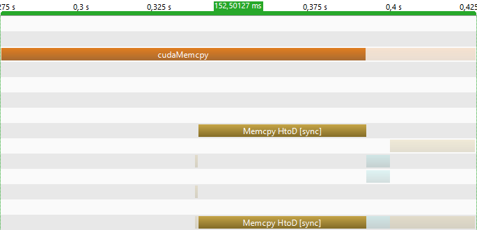

Report by [Dennis Weggenmann](https://github.com/DennisWeggenmann) and [Xiang Rong Lin](https://github.com/XiangRongLin) for the lecture "High Performance Computing" at the "Hochschule für Technik Stuttgart"

# Motivation
RGB to Grayscale conversation is an embarrassingly parallel Problem. So it's perfect for the GPU. Each Pixel can be calculated/converted independently. 
# GPU

## Problem
- memory transfer between Host and Device
- when to start measure time ? Before the kernel launch, before the memcopy or before the allocation 
## Solution attempt

## Implementation
### GPU Workflow
Host = CPU 

Device = GPU

The GPU needs to acces the Data from the main memory. Then the CPU instructs the GPU. The calculation will be  parallel  executed in cores and the result will be copied back to the main memory.

Thread

Each Thread gets mapped to one cuda core

Blocks:

Threads are grouped into Blocks

Grids:

Blocks are grouped into a Grid

Each Kernel launch creates one single Grid

https://developer-blogs.nvidia.com/wp-content/uploads/2020/06/kernel-execution-on-gpu-1-625x438.png

We have an input image which is loaded by stbi_load and returns and unsigned char.
Then we allocate memory for our grayscale image which the results will be copied in

So now we need to allocate memory for our RGB image on the Device. We do this with CudaMalloc
```C
cudaMalloc(&device_rgb, sizeof(uchar3) * pixel_size*3 );
```
we also allocate memory for our greyimage on the Device with
```C
cudaMalloc(&device_grey, sizeof(unsigned char) * pixel_size);
```
with cudaMemcpy the Imagedata will be copied to the memory we allocated for our RBG image. We also have to pass the size of the copied data and in which direction we are copying.
```C
cudaMemcpy(device_rgb, Image, sizeof(unsigned char) * pixel_size*3 , cudaMemcpyHostToDevice);
```
Now the data is in the GPU memory and we are able to launch our kernel.
### We are now on the Device

A Kernelfunction looks like a normal function but has a __global__
keyword befor it. With the global identifer we define a function that will run on the Device.
```C
ConvertToGrey<<<Grid, Block>>>(device_rgb, device_grey, rows, columns);
```
As parameters we pass our already allocated device_rgb and device_grey references and the rows and columns which are basically the width and height of our image.
If we take a look at the Kernel function the first thing we see is this
```C
int index_x = threadIdx.x + blockIdx.x * blockDim.x;
```
ThreadIdx, blockIdx and blockDim are cuda variables. We can access them when we run on the Device.
threadIdx : thread index in the block
blockIdx : block index in the grid
blockDim : number of threads by blocks.

We want the unique Grid index of a thread because threadIdx is only unique in its own Thread Block. So we multiply the Blocks index with the block dimension and add the Threadindex.
We do the same for the y index. And now we have the current pixel location

1d coordinate of the greyscale image
```C
int output_offset = index_y * columns + index_x;
```
now we write the result into the outputimage
```C
 output[output_offset] = rgb.x * 0.299f +rgb.y* 0.587f +rgb.z * 0.114f 
```
### we are now back on the Host
The kernel call is asynchronous. But in our case this doesnt bother us because we only have one stream so cudaMemcpy waits until the GPU has finished.
Now we copy the data back from the Device to the Host
```C
cudaMemcpy(host_grey, device_grey, sizeof(unsigned char) * pixel_size, cudaMemcpyDeviceToHost);
```
in the end we need to free the allocated memory on the Device
```C
cudaFree(device_rgb);
cudaFree(device_grey);
```

## Review
Looking at the Performance is interessting for a 27000x6000 pixel image the calculation takes 0,007 seconds but here is the catch. With nvprof or nvvp we can 
see that the GPU is only 1,8% of the time busy with computing. The rest is allocation (0,005 seconds) and memory transfer(0,15 seconds).

|Allocation |memcopy HtoD |memcopy DtoH |Kernel in |Gesamt | 
|---|---|---|---|---|
|5.12566 |0.1166639|0.033904|0.00754453|0.15250127|



The Orange bars are all the called cuda functions like cudamalloc.
The blue bar is the kernel activity

There is also a huge overhead from the cudaMemcpy call and the actual Memcpy operation

## Conclusion

# CPU
## Problem
- naive solution is single threaded
- processors can calculate 128/256 bit at once, but only part of it is used in a single iteration
- data is in rgbrgbrgbrgb format, but rrrrggggbbbb is needed
- memory is not aligned, meaning that in order to read 8-bytes we may need to actually read 16-bytes

## Solution attempt
### Multithreaded
The easiest place to optimize it, is utilizing all cores of a CPU and thus convert it to a multithreaded application.
This is done with OpenMP by adding the pragma `#pragma omp parallel for collapse(2)` (see [openmp_baseline.c](cpu/algorithms/openmp_baseline.c))).
`omp parallel for` parallelizes the `for` loop with `collapse(2)` collapsing both loops and thus parallelizing both.
This gives a more than 6 times performance boost.

In the next step the memory access can optimized.
Currently each thread calculates the grey value for a random pixel, depending on how it is scheduled by openMP.
For this it needs to load 3 unsigned char, so 24 bytes from memory.
But a CPU preloads more data into the cache anticipating that it will be needed.
This behavior can be used to by having each thread operating on a continuous section, thus using the data that is already in the CPU Cache (see [memory.c](cpu/algorithms/memory.c)).

### SIMD FMA
All references to intrinsic functions can be looked up here: https://www.intel.com/content/www/us/en/docs/intrinsics-guide/index.html

The next place to optimize is utilizing the full register of the CPU by using Single Instruction Multiple Data (SIMD).
For example we could add 16 8-bit integers at once in a 128 bit register instead of only a single one, thus theoretically creating a 16 time speedup.
Additionally one can use a dedicated arithmetic logic unit that multiplies two numbers and add it to an accumulator, knows as MAC-unit (multiplier-accumulator).
This takes the form of "fused multiply add" (FMA), which additionally only rounds at the end, thus combining two operations into one.

The data being in the form of rgbrgbrgbrgb appears for the first time.
For FMA a whole register need to be filled with only red, green or blue values, meaning we want the data in rrrrggggbbbb format.
This problem is ignored for now, by just setting the register with the appropriate values, which comes with its own performance problems, because with the data being spread out like this, multiple reads may be necessary.
```C
r_vector = _mm_set_ps(img[(i * channels)], img[(i + 1) * channels], img[(i + 2) * channels], img[(i + 3) * channels]);
g_vector = _mm_set_ps(img[(i * channels) + 1], img[(i + 1) * channels + 1], img[(i + 2) * channels + 1], img[(i + 3) * channels + 1]);
b_vector = _mm_set_ps(img[(i * channels) + 2], img[(i + 1) * channels + 2], img[(i + 2) * channels + 2], img[(i + 3) * channels + 2]);
```

With the data in the correct format the multiplication is very simple
```C
gray_vector = _mm_setzero_ps();
gray_vector = _mm_fmadd_ps(r_vector, r_factor, gray_vector);
gray_vector = _mm_fmadd_ps(g_vector, g_factor, gray_vector);
gray_vector = _mm_fmadd_ps(b_vector, b_factor, gray_vector);
```

Full code see [memory_simd_fma.c](cpu/algorithms/memory_simd_fma.c)

A problem with FMA is, that the basic FMA instruction set only supports working with 32-bit and 64-bit floating point numbers.
This means that with a 128-bit register a maximum of 4 pixel can be calculated at once.

### SIMD SSE
This implementation if completly copied from a Stackoverflow post by [Rotem](https://stackoverflow.com/users/4926757/rotem): https://stackoverflow.com/a/57844027/13516981
Only modification made was making it compatible with pure C, since it was using C++ features (see [memory_simd_sse.c](cpu/algorithms/memory_simd_sse.c))

It has 2 major optimization areas.

First it utilizes shuffle (`_mm_shuffle_epi8`), concat (`_mm_alignr_epi8`) and shift (`_mm_slli_si128`) functions to solve the problem of rearranging the bytes from rgbrgbrgbrgb to rrrrggggbbbb.
For example one can group the bytes according to their color like this.
```C
const __m128i shuffle_mask = _mm_set_epi8(9, 6, 3, 0, 11, 8, 5, 2, 10, 7, 4, 1, 9, 6, 3, 0);

__m128i r3_r2_r1_r0_b3_b2_b1_b0_g3_g2_g1_g0_r3_r2_r1_r0 = _mm_shuffle_epi8(r5_b4_g4_r4_b3_g3_r3_b2_g2_r2_b1_g1_r1_b0_g0_r0, shuffle_mask);
```
Or like this
```C
// The 12 is the amount of bytes to shift the result
__m128i b7_g7_r7_b6_g6_r6_b5_g5_r5_b4_g4_r4 = _mm_alignr_epi8(b7_g7_r7_b6_g6_r6_b5_g5, r5_b4_g4_r4_b3_g3_r3_b2_g2_r2_b1_g1_r1_b0_g0_r0, 12);
```
If the bytes are not at the start or end in order to concatenate them they are shifted like this
```C
// 8 bytes to the left
__m128i g3_g2_g1_g0_r3_r2_r1_r0_zz_zz_zz_zz_zz_zz_zz_zz = _mm_slli_si128(r3_r2_r1_r0_b3_b2_b1_b0_g3_g2_g1_g0_r3_r2_r1_r0, 8);
// 4 bytes to the right
__m128i zz_zz_zz_zz_r7_r6_r5_r4_b7_b6_b5_b4_g7_g6_g5_g4 = _mm_srli_si128(r7_r6_r5_r4_b7_b6_b5_b4_g7_g6_g5_g4_r7_r6_r5_r4, 4);
```

Additionally it sacrifices some accuracy by calculating the gray value with 16-bit integers instead of 32-bit floats.
But the most important for me is, that it showed me how to work with the bit modification functions in a structured manner by naming the variables according to the bytes it contains.

### SIMD AVX
With this knowledge the next step is using the AVX instruction set, which operates on 256-bit registers unlike 128-bit in SSE.
This in theory allows one to process twice the amount of pixels at once.
Unfortunately many AVX functions behave slightly different compared to their SSE counterpart in the form of only operating within 128-bit lanes instead of across the whole 256-bit register.
This means that it is not possible to shuffle a byte from the lower lane to the upper lane with `_mm256_shuffle_epi8`.
So in a register with `gA_rA_b9_g9_r9_b8_g8_r8_b7_g7_r7_b6_g6_r6_b5_g5_r5_b4_g4_r4_b3_g3_r3_b2_g2_r2_b1_g1_r1_b0_g0_r0`, where the lane split is between g5 and r5, it is not possible to group all red values because r6, r7, r8 and r9 are in the upper lane whereas the other values are in the lower lane.

Because of this for AVX a different set of functions is used in order to group the bytes of each color.
The central function is `_mm256_blendv_epi8(__m256i a, __m256i b, __m256i mask)` which allows to combine parts of the first register with the second one according to the mask.
```C
__m256i g4_g3_g2_g1_g0_b4_b3_b2_b1_b0_r5_r4_r3_r2_r1_r0_b9_b8_b7_b6_b5_rA_r9_r8_r7_r6_r5_r4_r3_r2_r1_r0 =
    _mm256_blendv_epi8(
        g4_g3_g2_g1_g0_b4_b3_b2_b1_b0_r5_r4_r3_r2_r1_r0_b9_b8_b7_b6_b5_rA_r9_r8_r7_r6_gA_g9_g8_g7_g6_g5,
        b9_b8_b7_b6_b5_rA_r9_r8_r7_r6_gA_g9_g8_g7_g6_g5_g4_g3_g2_g1_g0_b4_b3_b2_b1_b0_r5_r4_r3_r2_r1_r0,
        _mm256_set_epi8(0, 0, 0, 0, 0, 0, 0, 0, 0, 0, 0, 0, 0, 0, 0, 0, /**/ 0, 0, 0, 0, 0, 0, 0, 0, 0, 0, 128, 128, 128, 128, 128, 128));
```
In this example we want to combine the group of red bytes `r5_r4_r3_r2_r1_r0` of the second register with the group of `rA_r9_r8_r7_r6` in the first one.
They are deliberately lined up, so that in the first register before the group of `rA_r9_r8_r7_r6` is exactly enough space to fit in the first 6 bytes ``r5_r4_r3_r2_r1_r0`.
Accordingly the mask is set to use all values of the first register, except the first 6 ones.

This setup is done through `_mm256_shuffle_epi8` with which we can still shuffle inside the lanes in order to group the bytes.
Afterwards we can use `_mm256_permute2x128_si256(__m256i a, __m256i b, 1)` in order to swap the lanes so that we can blend them.
In some places `_mm256_alignr_epi8` is also used.
Like in SSE it concatenates registers, although it only works on 128-bit lanes.

For the exact steps see [memory_simd_avx.c](cpu/algorithms/memory_simd_avx.c) where the variable names reflect the outcome of a function.

Another change is aligning the memory of the input and output image.
This allows using the aligned load and store functions instead of the unaligned ones (`_mm256_load_si256` instead of `_mm256_loadu_si256`).
With this we may avoid loading data that is spread across boundaries of a address and thus reducing memory transfer.
The output is aligned with by allocating the memory with `aligned_alloc(32, size)` instead of `malloc(size)`.
For the input image the library used to load the image `stb_image.h`, allows to override the default `malloc` function used.
We do so be defining following values before the include of that library.
```C
#define STBI_MALLOC(sz)           aligned_alloc(32, size)
```

## Benchmarks
With 
- AMD Ryzen 5 3600 6-Core Processor 
- gcc 11
- compiled `gcc -fopenmp grayscale.c -lm -march=native -O`
- 20 runs each
- 27000x6000 pixel image https://photojournal.jpl.nasa.gov/catalog/?IDNumber=PIA03239

### Baseline
|time in s|megapixel per s|
|---|---|
|2.739997|56.3852|

### openmp baseline

|thread number|time in s|megapixel per s|
|---|---|---|
|12|0.411790|375.1795|
|32|0.414154|373.0381|
|64|0.414555|372.6776|
|128|0.430195|359.1287|

### memory

|thread number|time in s|megapixel per s|
|---|---|---|
|32|0.032053|4820.0608|
|64|0.031559|4895.3717|
|128|0.030711|5030.6157|
|256|0.032755|4716.6270|

### FMA

|thread number|time in s|megapixel per s|
|---|---|---|
|12|0.035387|4365.8509|
|32|0.035855|4308.9137|
|64|0.035242|4383.8510|
|128|0.034176|4520.5836|
|256|0.035138|4396.8387|

### SSE

|thread number|time in s|megapixel per s|
|---|---|---|
|12|0.030364|5088.0302|
|32|0.030036|5143.7032|
|64|0.030248|5107.6352|
|128|0.030838|5009.9306|
|256|0.032062|4818.7077|

### AVX

|thread number|time in s|megapixel per s|
|---|---|---|
|12|0.030029|5144.9279|
|32|0.029775|5188.7483|
|64|0.030188|5117.7360|
|128|0.030685|5034.9111|
|256|0.032302|4782.7716|

### CPU comparison
|CPU|algorithm|thread number|time in s|megapixel per s|
|---|---|---|---|---|
|AMD Ryzen 5 3600 (6 Core)|simd_sse|32|0.030036|5143.7032|
|AMD Ryzen 5 3600 (6 Core)|simd_avx|32|0.029775|5188.7483|
|Intel Core i9-9880H (8 Core)|simd_sse|64|0.027484|5621.3304|
|Intel Core i9-9880H (8 Core)|simd_avx|128|0.027279|5663.5644|

## Review
A review of the AVX variant
### Memory Bottleneck
The memory access should not be the bottleneck.
There are many indicator for this.

First one being that the Intel Core i9-9880H performs better than the AMD Ryzen 5 3600 even though in has a memory bandwidth of only [39.74 GiB/s](https://en.wikichip.org/wiki/intel/core_i9/i9-9880h) compared to [47.68 GiB/s](https://en.wikichip.org/wiki/amd/ryzen_5/3600).

Second one being that the alignment of the memory in the AVX step, did not change the performance in any noticeable way.
One can test it out by replacing `_mm256_load_si256` with `_mm256_loadu_si256` and `_mm256_store_si256` with `_mm256_storeu_si256` and reverting the changes to align the memory.

Lastly doing a calculation of the theoretical amount of transferred data, we are below the available bandwidth.
```
pixel = 27000*6000 = 162000000
duration = 30ms = 0.03s
pixel_per_iteration = 32
bytes_per_pixel = 3
iterations = pixel / pixel_per_iteration = 5062500
bytes_read_per_iteration = 128 // it is not bytes_per_pixel*pixel_per_iteration=3*32=96, because we are effectively reading so many bytes in this sequence: 32 - 16 - 32 - 16. But because each read is 32-bytes, it results in 4*32=128 bytes read. Because the CPU address width is 8-byte there are no considerations here with 32-byte aligned memory.
bytes_read = bytes_read_per_iteration * iterations = 128 * 5062500  = 648000000
bytes_written = pixel * bytes_per_pixel = 162000000 * 3 = 486000000
bytes_transferred = bytes_read + bytes_written = 648000000 + 486000000 = 1134000000
transfer_rate = bytes_transferred / duration = 1134000000 (byte) / 0.03s = 37800000000 b/s = 35,20 Gb/s 
```

### Latency and Throughput
Each SIMD functions has a different latency and throughput.
Latency means how many clock cycles it takes for the calculation to be complete and throughput means how much of a clock cycle the operations takes.
Taking [_mm256_load_si256](https://www.intel.com/content/www/us/en/docs/intrinsics-guide/index.html#text=_mm256_load_si256&ig_expand=1935,515,305,4291) as example on the Haswell architecture.
It has a latency of 1 and throughput of 0.25.
This mean we can load 4 independent datasets in a single clock cycle.
This is a source of optimization, that was not done here.
Instead functions were selected purely on being able to arrange the bytes in a way that was needed.
The linked intrinsic guide is for Intel, so one for AMD would need to be found first.

## Conclusion
